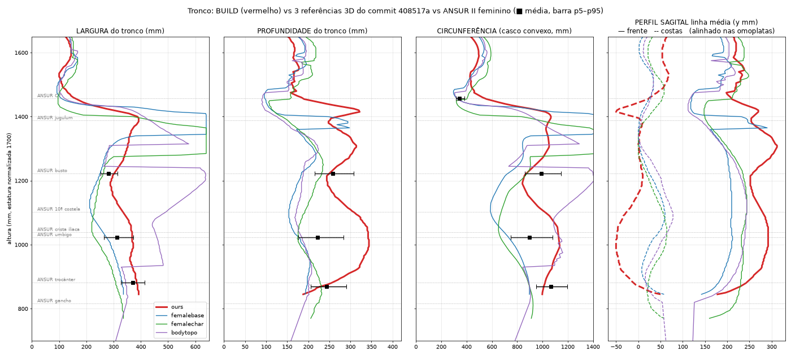
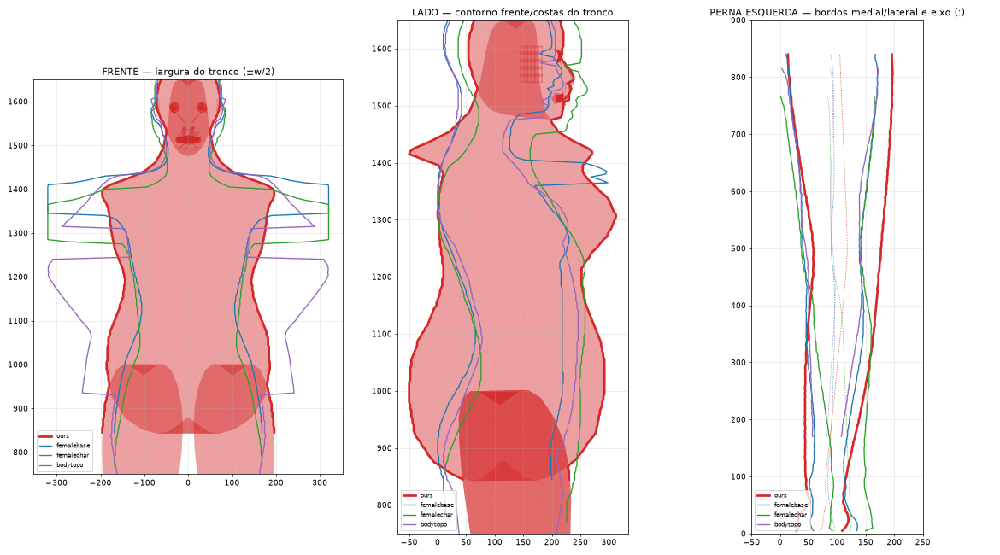

# REF STUDY 01: referências → medição → mecanismo (anatomia macro, P0)

**Data:** 2026-09-24 · **Estado:** estudo e diagnóstico. **Nenhuma geometria foi alterada.**
**Pedido:** feedback visual do Edmundo sobre a build avaliada ("BUILD 01") e referências do commit `408517a`.
**Método pedido:** `REFERÊNCIA → MEDIÇÃO → HIPÓTESE → ALTERAÇÃO → BUILD → MEDIÇÃO → COMPARAÇÃO`.
Este documento cobre as três primeiras etapas.

Classificação usada (DEVELOPMENT_AGREEMENT §4): **FACT** (fonte externa), **MEASURED** (instrumento
deste estudo), **OBSERVED** (visto em imagem), **INFERRED**, **HYPOTHESIS**, **UNKNOWN**.

---

## 0. Identificação

| | |
|---|---|
| Build medida | `builds/build02_realistic_female_s42.zip` (SHA256 `473cb42d…8ade`), gerada a partir do commit `d9247fd`, preset `realistic_female`, seed 42, digest `63a579d98df0c8d8`. É a build a que o feedback chama **BUILD 01**. O nome do ficheiro diz "build02" por causa da numeração do acordo (S4 = BUILD 02); o artefacto é o mesmo. |
| Referências | commit `408517a` ("estuda aarena"), pasta `treino para o arena/` |
| Verdade antropométrica | **ANSUR II (2012), mulheres, n = 1986**: CSV público do DCPH-A ("ANSUR II FEMALE Public.csv", SHA256 `ed7e800a…757a`). Subconjunto de mulheres negras (`DODRace = 2`): n = 656. |
| Instrumento | `tools/refstudy/` (novo). Reprodução completa: `PY=<python com bpy 5.0.1> bash tools/refstudy/run_all.sh` |
| Dados e figuras | `docs/ref_study_01/` (`metrics.txt`, `metrics.json`, `ansur_ratios.json`, `fig_*.png`) |

Reprodutibilidade (MEASURED): o pipeline foi corrido duas vezes, a segunda a partir de um diretório de
trabalho apagado, e os números saíram idênticos.

**Nota sobre o repositório (FACT, git):** `main` aponta agora para `408517a`, um commit **raiz sem pai**.
Não partilha histórico com `8716b88` nem com os branches de trabalho. Não fiz merge nem rebase. As
referências são lidas diretamente de `408517a` com `git archive` e não foram copiadas para o branch.

---

## 1. Resumo executivo

1. **O "jarro" do tronco tem causa medida:** as secções do tronco são quase redondas. A razão
   profundidade/largura é 0.93 na cintura (ANSUR 0.709) e 0.87 na anca (ANSUR 0.658). A profundidade
   da cintura (342 mm) é **1.54×** o ANSUR e a das nádegas (342 mm) é **1.41×**. A circunferência da
   cintura é igual à da anca (razão 1.00; ANSUR 0.842, nas referências 0.72–0.81): **não existe
   cintura em circunferência**.
2. **Todo o bloco abdominal está deslocado para cima:** a estação "waist" está **+110 mm** acima do
   mínimo de largura das referências, o busto +66 mm, o umbigo +74 mm e a crista ilíaca +32 mm. A
   anca, o gancho e o acrómio estão corretos (±20 mm).
3. **O "capuz" nas costas é uma estação:** as duas estações da rampa do trapézio (z = 1414 e 1401 mm)
   têm **275 e 364 mm de profundidade**, as mais profundas do corpo. Resultado medido: as costas altas
   ficam **104 mm atrás do occipital**; nas três referências ficam entre −22 e −2 mm, ou seja,
   alinhadas com ele.
4. **As costas não têm lordose:** a concavidade lombar mede 26 mm contra 54–70 mm nas referências. O
   bump dos glúteos está centrado a z = 1020 mm; o ápice real das nádegas fica a 845–910 mm (ANSUR
   `buttockheight` 870). Esse bump enche a zona lombar em vez de formar a nádega: é a curva
   "parabólica" das costas.
5. **O pescoço é absorvido pela cabeça:** a casca do crânio desce atrás até z = 1475 mm, 17 mm acima
   do queixo. O trapézio começa 39 mm abaixo do C7 do ANSUR. A circunferência do pescoço (453 mm) é
   **1.31×** o ANSUR e a profundidade é 168 mm (referências 98–108).
6. **As pernas estão arqueadas por construção:** o landmark do joelho foi posto **28 mm lateral** à
   linha anca–tornozelo (genu varum). Nas referências o joelho está sobre essa linha ou medial a ela.
   A circunferência mínima do joelho é 377 mm (referências 305–331): não há estreitamento no joelho.
7. **Mãos e pés têm dimensões globais corretas mas forma errada:** comprimento e largura da mão e do
   pé estão dentro do intervalo p5–p95 do ANSUR (§6). Os defeitos que viste (dedos finos, pé sem
   leitura) são de **forma regional**, não de escala. Isso pede um estudo diferente (P1).

Conclusão: o feedback visual e as medições coincidem em todas as regiões P0 avaliadas. Cada sintoma
tem uma origem identificada numa linha de `core/anatomy.py` ou `generators/body.py` (§5). Nenhum
exige mudar de arquitetura para o primeiro ciclo de correção.

---

## 2. As referências e o que cada uma pode ensinar

| Ficheiro | Conteúdo real (MEASURED/OBSERVED) | Serve para | Limites |
|---|---|---|---|
| `Female base.obj` | corpo inteiro, uma casca, 18.6k v, **T-pose**, frente +Y | tronco, costas, pescoço, pernas, pés | braços em T contaminam larguras acima da axila |
| `Body Topo.blend` ("Geo body") | corpo em **A-pose, sem pés** (acaba 159 mm acima do chão), subsurf, frente −Y | tronco, costas, pescoço, topologia (loops) | estatura **INFERRED** por (topo − gancho)/0.5198; nas cotas da cintura e da anca **as mãos tocam na anca**, por isso as larguras aí são inválidas (458/482 mm). As profundidades são válidas. |
| `FemaleCharacter.blend` (Plane.003) | corpo em T-pose, estilizado, unidades arbitrárias, frente −Y | tronco (com cautela) | proporções estilizadas (cintura/anca 0.68) |
| `fffemale 11.obj` | low-poly de jogo; o corpo só tem **pele exposta** (tronco coberto pela roupa) | cabeça, pernas | não serve para o tronco |
| `Lucia_Prototype_v01.fbx` | malha **MakeHuman** `female_generic` + esqueleto de 163 ossos; só **cabeça e mãos** (o resto foi apagado sob a roupa); roupa e cabelo | cabeça, **mãos** (P1), nomes de ossos para o futuro rig | sem tronco |
| `whitewalker-2016-06-06.blend` | cabeça e pescoço esculpidos (7k v avaliados) | cabeça, nuca (P2) | só cabeça |
| imagens (`Female-Body-Base-Mesh.jpg`, `.webp`, esboço `31e1….jpg`, `eglwbay1.jpg`) | vistas frente/lado/costas com wireframe | leitura qualitativa, fluxo de topologia | não medidas neste estudo (sem calibração) |
| `ChatGPT…png`, `Gemini…jpg` | **Lucia**: personagem-alvo | variação-alvo (depois da anatomia) | não é verdade anatómica |

Princípio aplicado (o teu §14): nenhuma malha é copiada. As referências fornecem **relações**
(razões, alturas relativas, alinhamentos) que o gerador tem de produzir **para qualquer spec**. O
ANSUR fornece a distribuição populacional (média e p5–p95). As três referências 3D mostram como essas
relações aparecem numa superfície contínua.

---

## 3. Método (instrumento)

- **Extração (bpy 5.0.1, headless):** malha avaliada em espaço-mundo (modificadores aplicados; subsurf
  limitado a 1 nível). No nosso modelo: todas as cascas do `.blend` versionado.
- **Normalização:** estatura 1700 mm, chão em z = 0, frente em +Y, x centrado. A orientação foi
  confirmada visualmente pelo nariz e pelos pés (`fig_head_neck_side.png`).
- **Cortes horizontais a cada 5 mm.** Cada componente conexo é preenchido por scanline par-ímpar numa
  grelha de 2 mm e as grelhas são unidas. Isto é necessário porque as nossas cascas se sobrepõem
  (tronco, pernas, cabeça); um preenchimento par-ímpar global abriria buracos.
- **No nosso modelo são excluídas as cascas dos braços, mãos e dedos** (24 componentes), para medir o
  tronco como o ANSUR (sem braços). As referências são uma casca única; abaixo da axila os braços
  separam-se sozinhos.
- **Medidas por corte (componente que contém x = 0):** largura, profundidade, circunferência (perímetro
  do casco convexo, equivalente à fita métrica) e contornos frente/costas na linha média (|x| ≤ 10 mm).
- **Landmarks automáticos:** gancho (o corte mais alto com x = 0 vazio), busto (profundidade máxima em
  0.68–0.78·S), cintura natural (largura mínima em 0.58–0.70·S), umbigo (cota ANSUR 0.6017·S), anca
  (largura máxima), nádega (profundidade máxima), pescoço (largura mínima em 0.80–0.875·S) e, no
  perfil sagital, ápice torácico, ápice glúteo e concavidade lombar em relação à corda entre ambos.

Limitações declaradas: (a) as larguras do bodytopo na cintura e na anca estão contaminadas pelas mãos;
(b) as medidas de cabeça incluem as orelhas nas referências mas não no ANSUR, por isso **a cabeça não
é diagnosticada aqui** (§7); (c) a circunferência das pernas é aproximada por uma elipse a partir da
largura e da profundidade (Ramanujan).

---

## 4. Resultados (MEASURED, @1700 mm)

### 4.1 Tronco contra o ANSUR

| medida | ANSUR média | p5–p95 | **BUILD** | female base | female char | body topo | BUILD / ANSUR |
|---|---|---|---|---|---|---|---|
| profundidade do peito | 258 | 216–307 | **314** | 218 | 236 | 224 | **1.22** ✗ |
| largura do peito | 281 | 252–314 | **352** | 268 | 268 | 280 | **1.25** ✗ |
| largura da cintura (umbigo) | 313 | 264–372 | 368 | 272 | 228 | (458\*) | 1.18 |
| profundidade da cintura | 223 | 177–284 | **342** | 176 | 176 | 184 | **1.54** ✗ |
| circunferência da cintura | 899 | 750–1082 | **1127** | 728 | 666 | (1133\*) | **1.25** ✗ |
| largura da anca | 370 | 328–413 | 392 | 336 | 336 | (482\*) | 1.06 |
| profundidade das nádegas | 243 | 206–291 | **342** | 204 | 232 | 208 | **1.41** ✗ |
| circunferência das nádegas | 1067 | 953–1196 | 1127 | 897 | 926 | (1161\*) | 1.06 |
| circunferência do pescoço | 345 | 315–382 | **453** | 296 | 324 | 394 | **1.31** ✗ |
| altura do gancho | 816 | 776–859 | 840 | 840 | 765 | 815 | 1.03 |

\* contaminado pelas mãos em A-pose.

| razão de forma | ANSUR (p5–p95) | mulheres negras ANSUR | **BUILD** | female base | female char |
|---|---|---|---|---|---|
| prof./larg. da cintura | 0.709 (0.623–0.809) | 0.746 | **0.929** ✗ | 0.647 | 0.772 |
| prof. nádegas / larg. anca | 0.658 (0.590–0.740) | 0.686 | **0.872** ✗ | 0.607 | 0.690 |
| circ. cintura / circ. nádegas | 0.842 (0.749–0.946) | 0.836 | **1.000** ✗ | 0.811 | 0.719 |
| prof./larg. do peito | 0.918 (0.798–1.045) | 0.930 | 0.892 | 0.813 | 0.881 |

Leitura: a razão do peito está correta, mas só porque largura e profundidade estão **ambas** 22–25 %
acima do ANSUR. Na cintura e na anca a forma está fora de p5–p95.

### 4.2 Alturas das estações (gerador `_Z` contra ANSUR)

| estação do gerador | z/S no código | referência | Δ @1700 mm |
|---|---|---|---|
| jugulum | 0.795 | suprasternale 0.8164 (0.804–0.828) | **−36** |
| neck_top (início do trapézio) | 0.834 | cervicale/C7 0.8570 (0.846–0.868) | **−39** |
| acromion | 0.818 | acromial 0.8198 | −3 |
| bust | 0.758 | chest height 0.7194 (0.695–0.743) | **+66** |
| waist (estação) | 0.700 | refs 3D: mínimo de largura em 0.612–0.656 | **+110** (vs 0.635) |
| navel | 0.645 | omphalion 0.6017 (0.580–0.624) | **+74** |
| iliac | 0.630 | iliocristale 0.6113 (0.590–0.632) | +32 |
| hip | 0.530 | trochanterion 0.5190 | +19 |
| crotch | 0.490 | crotch 0.4802 | +17 |
| knee | 0.287 | patela 0.2756 | +19 |

### 4.3 Perfil sagital (costas) e pescoço

| medida | **BUILD** | female base | female char | body topo |
|---|---|---|---|---|
| concavidade lombar (mm) | **26.5** | 55.7 | 53.7 | 69.7 |
| cota da concavidade lombar | 1185 | 1105 | 1055 | 1100 |
| ápice glúteo (z) | **980** | 910 | 845 | 880 |
| nádega atrás do ápice torácico (mm) | **+50** | −8 | −20 | −16 |
| barriga: frente no umbigo − frente na cintura (mm) | **+40** | +2 | −2 | −2 |
| costas altas em relação ao occipital (mm; negativo = atrás) | **−104** | −2 | −22 | −10 |
| cota das costas altas mais posteriores | **1415** | 1335 | 1335 | 1335 |
| recuo da nuca face ao occipital (mm) | **16** | 32 | 36 | 24 |
| largura / profundidade mínima do pescoço | 124 / **168** | 92 / 98 | 96 / 108 | 100 / 152 |
| casca do crânio: z mínimo atrás | **1475** (queixo 1461) | (casca única) | | |

### 4.4 Pernas

| medida | **BUILD** | female base | female char | body topo | ANSUR |
|---|---|---|---|---|---|
| eixo da perna x: coxa / joelho / tornozelo | 106 / **116** / 82 | 93 / 92 / 85 | 87 / 92 / 119\*\* | 93 / 95 / 82 | n/a |
| circunferência mínima do joelho | **377** | 311 | 331 | 305 | n/a |
| circunferência da coxa | 578 | 528 | 545 | 531 | 643 (554–737) |
| circunferência do gémeo / cota | 390 / **365** | 320 / 390 | 343 / 440 | 308 / 425 | 390 |
| circunferência do tornozelo | 207 | 199 | 196 | 170 | 225 (202–252) |

\*\* pés afastados na pose.

---

## 5. Sintoma → mecanismo em código (INFERRED a partir de MEASURED, sem alterações)

### T1: "jarro" (cheio → estreito → cheio)
Em `anatomy.py::trunk_sections` (tabela avaliada, `realistic_female`):

| z (mm) | estação | larg. | prof. total | prof./larg. |
|---|---|---|---|---|
| 1295 | bust | 363 | **342** (frente 200 com `fs = 1 + bust/(0.8·chest)`) | 0.94 |
| 1190 | waist | 275 | 223 | 0.81 |
| 1097 | navel | 325 | 276 | 0.85 |
| 1071 | iliac | 375 | **332** | 0.88 |
| 901 | hip | 387 | **343** | 0.89 |

- **Mecanismo:** as meias-profundidades são frações **da meia-largura** (`chest·0.80`, `hip·0.84`,
  `hip·0.86`). Isto dá secções quase circulares, e o busto ainda soma `front_scale` 1.40 **mais** o
  bump do busto em `body.py`.
- `chest_half = shoulder_half·0.9·1.03` dá **356 mm** de largura contra 281 no ANSUR. O peito é
  derivado do biacromial com um fator sem fonte.

### T2: cintura, umbigo e busto demasiado altos
`_Z`: `waist 0.700`, `navel 0.645`, `bust 0.758`, `iliac 0.630` (tabela §4.2). A estação mais estreita
fica debaixo do peito. Entre 0.645 e 0.53 há três estações já com 85–100 % da largura da anca, e isso
lê-se como barriga. No perfil, a frente no umbigo está 40 mm à frente da frente na cintura
(referências ≈ 0).

### B1: "capuz / hump" nas costas altas
As duas estações da rampa do trapézio (`add(zf("neck_top") - 0.002·s, …, 0.075·s, bs = 1.16)` e
`add(zf("neck_top") - 0.010·s, …, 0.100·s, bs = 1.14)`) recebem profundidades **absolutas** de 0.075·S
e 0.100·S. `Section.depth` é **meia-profundidade**, por isso o total fica em 275 e 364 mm, com a
superfície posterior em y = −175 e −221 mm, contra −123 mm na linha do ombro logo abaixo.
**HYPOTHESIS:** foi escrito como profundidade total (erro meia/total). Metade daria 138 e 182 mm,
valores plausíveis para a base do pescoço e o trapézio superior. O comentário S3.7 da rampa só trata
da largura; a profundidade nunca foi medida.

### B2: costas "parabólicas", sem lordose
- O bump dos glúteos está centrado em `iliac.z − 0.030·S` = **1020 mm** (0.60·S), com σz = 127 mm e
  amplitude 27 mm para trás. A cota ANSUR da nádega é 0.512·S (870 mm) e as referências dão 845–910.
  O campo enche a lordose em vez de formar a nádega.
- Todas as estações têm centro `y ≈ front_off` (−3 a −27 mm). **Não existe curva da coluna** (cifose e
  lordose) no esqueleto do tronco. A forma sagital sai apenas de larguras e profundidades simétricas.
- Referências (MEASURED): as costas torácicas são o ponto mais posterior (z ≈ 1335), a zona lombar
  recua 54–70 mm e a nádega volta a ficar alinhada com as costas (−8 a −20 mm).

### N1: pescoço dentro do crânio
- A casca da cabeça desce atrás até 1475 mm (o queixo está a 1461). O elipsoide craniano
  (`head_center.z = chin + 0.52H`, `rz = 0.52H`) chega ao queixo **em toda a volta**, incluindo o
  occipital. Nas referências a nuca recua 24–36 mm abaixo do occipital; no BUILD recua 16 mm e a 1530.
- `neck_top 0.834` e `jugulum 0.795` ficam 39 e 36 mm abaixo do ANSUR (C7 0.857, suprasternale
  0.816). O trapézio começa baixo **e** fundo (B1), e o crânio desce: entre os dois não sobra pescoço
  visível atrás.
- O pescoço anatómico é **inclinado** (C7 à altura do queixo, jugulum 70 mm abaixo). O gerador faz um
  pescoço vertical com anéis horizontais.

### L1: pernas arqueadas e joelho sem forma
- `knee.x = hip_half·0.52 + 0.010·S` = 117.6 mm; `hip.x` = 100.6; `ankle.x` = 78.4. O joelho fica
  28 mm **lateral** à linha anca–tornozelo. A anatomia feminina tem o joelho sobre essa linha ou medial
  (ângulo Q). As referências dão joelho ≈ coxa ≈ 92–95.
- `knee` com `r_th·0.63` × `r_th·0.66` dá cerca de 377 mm de circunferência. As referências dão
  305–331: o joelho não estreita.
- O gémeo está em `knee.lerp(ankle, 0.16..0.40)`, com máximo em 365 mm contra 390–440 nas referências
  (ligeiramente baixo).

---

## 6. Mãos e pés: dimensões corretas, forma errada (P1)

| medida | BUILD (S3.6/S3.8) | ANSUR @1700 | p5–p95 |
|---|---|---|---|
| comprimento do pé | 257.8 | 257.3 | 242–272 |
| comprimento da mão | 180.2 | 189.1 | 177–203 |
| largura da mão | 77.5 | 81.6 | 76–88 |

Os números globais estão dentro de p5–p95. **UNKNOWN:** espessura dos dedos, distribuição das
falanges, arco do pé, forma do antepé. A referência útil é a mão MakeHuman do FBX. O próximo estudo
regional deve medir secções por dedo (largura/espessura em MCP, PIP, DIP) e a planta do pé por
cortes. Não o fiz aqui porque é P1 e exige segmentação por dedo.

## 7. Cabeça (P2): não diagnosticada

Os números preliminares (largura 142 mm e comprimento 176 mm no BUILD) não são comparáveis sem separar
orelhas e nariz do crânio. O whitewalker e a cabeça MakeHuman permitem esse estudo. Fica para a fase
P2, como pediste.

---

## 8. O que aprendi: regras gerais para o gerador

Estas são as relações que o gerador passa a ter de satisfazer para **qualquer** spec. Não são
vértices de uma referência.

1. **Alturas das estações em frações ANSUR** (médias com p5–p95 como limites de variação): C7 0.857,
   jugulum 0.816, acrómio 0.820, axila 0.761, busto 0.719, 10ª costela 0.649, umbigo 0.602, crista
   ilíaca 0.611, trocânter 0.519, nádega 0.512, gancho 0.480, patela 0.276, maléolo 0.0385.
2. **A profundidade é uma grandeza própria, não uma fração da largura:** prof./larg. = 0.92 no peito
   (com mamas), 0.71 na cintura e 0.66 na anca (0.75 e 0.69 no subconjunto de mulheres negras,
   relevante para a Lucia).
3. **A cintura existe em circunferência:** circ. cintura / circ. anca = 0.84 (p5 0.75).
4. **A coluna é uma curva:** as costas torácicas são o ponto posterior de referência, a lordose
   lombar recua cerca de 55–70 mm (@1700) em relação à corda tórax–nádega, e o ápice da nádega fica a
   cerca de 0.51–0.54·S, alinhado com as costas torácicas.
5. **Perfil cabeça–pescoço–costas:** o occipital e as costas altas estão aproximadamente na mesma
   vertical (±20 mm). A nuca recua cerca de 25–35 mm. O C7 está à altura do queixo. O pescoço é
   inclinado.
6. **O eixo da perna converge:** o joelho não é lateral à linha anca–tornozelo. O joelho estreita
   (cerca de 0.8× a circunferência do gémeo).

---

## 9. Hipóteses e alterações propostas (NÃO implementadas)

Cada alteração é pequena, está localizada na origem e tem um critério numérico. Proponho testá-las
uma a uma, medindo com este mesmo instrumento.

| # | Hipótese | Alteração na origem | Critério de aceitação (medido por `tools/refstudy`) |
|---|---|---|---|
| H1 | O capuz vem da profundidade meia/total das 2 estações do trapézio | profundidade dessas estações → meia-profundidade coerente com a linha do ombro e costas posteriores ≤ costas torácicas | costas altas vs occipital entre −30 e 0 mm; sem pico de profundidade em 1380–1440 |
| H2 | O jarro vem da profundidade escalada pela largura | nova tabela de meias-profundidades próprias (razões §8.2) com `front_scale` do busto limitado | prof./larg. da cintura em [0.62, 0.81]; nádega/anca em [0.59, 0.74]; profundidade do peito, cintura e nádegas dentro de p5–p95 |
| H3 | A barriga vem das estações abdominais altas | `_Z` do busto, cintura, umbigo e ilíaco → frações ANSUR/refs (§8.1) | circ. cintura/anca em [0.75, 0.95]; barriga (frente umbigo − frente cintura) ≤ 10 mm; mínimo de largura em 0.61–0.66·S |
| H4 | Sem lordose porque não há curva da coluna e o glúteo está alto | centros `y` das estações seguem uma curva sagital (cifose/lordose); bump glúteo para a cota da nádega (0.51–0.54·S) | concavidade lombar 45–75 mm; ápice glúteo 845–920 mm; nádega vs tórax entre −25 e +5 mm |
| H5 | O pescoço é engolido pelo crânio e pelo trapézio baixo | `neck_top` → C7 (0.857), jugulum → 0.816, anéis do pescoço inclinados; recorte posterior do elipsoide craniano acima da nuca | nuca recua 20–40 mm; profundidade do pescoço 95–130 mm; circunferência do pescoço em 315–382 |
| H6 | Pernas arqueadas por landmark | `knee.x` sobre a linha anca–tornozelo (ou medial ≤ 10 mm); joelho mais estreito | joelho − linha ∈ [−10, +3] mm; circ. do joelho ≤ 0.85× circ. do gémeo; gémeo em 0.23–0.26·S |
| H7 | Peito largo por derivação do biacromial | `chest_half` a partir de `chestbreadth` ANSUR (0.1655·S) em vez de `shoulder_half·0.9` | largura do peito 252–314 |

Ordem recomendada: **H1 → H3 → H2 → H4 → H5 → H6 → H7**. H1 é isolada e barata; H3 e H2 mexem nas
mesmas estações e devem ser medidas em conjunto; H4 depende de H2/H3. Os pins de digest vão mudar
(esperado e declarado em cada passo); S2 (topologia 0/0/0) e as junções de S3 têm de continuar a
passar.

---

## 10. Protocolo do próximo BUILD (resposta ao teu §2 e §17)

- **Pergunta única:** *a anatomia macro do tronco, costas, pescoço e pernas melhorou?*
- **Renders:** sem cabelo e com material neutro (cinzento, sem SSS), nas vistas frente, costas, lado e
  3/4, mais **wireframe** e sobreposição da silhueta do BUILD anterior.
- **Números:** `metrics.txt` do BUILD novo lado a lado com este, mais a tabela de critérios da §9
  (passa/falha por linha, incluindo o que piorou).
- **Blender:** atenção, a figura olha para **+Y**. Na vista Front do Blender (Numpad 1) vês **as
  costas**; usa Ctrl+Numpad 1 para a frente. (O root com rotação existe em `core/conventions.py`, mas
  `generate_character` não o usa.)

---

## 11. Minha avaliação (DEVELOPMENT_AGREEMENT §2)

**Concordo** que nenhuma região está boa e que o próximo passo é anatomia, não detalhe. As medições
confirmam o teu feedback **em cada região P0**, com números: o jarro, o capuz, o pescoço e o
arqueamento aparecem todos nos dados.

**Concordo** com a mudança de método. Vários defeitos medidos aqui, como a profundidade do trapézio e
a cota do glúteo, sobreviveram a S3 porque os critérios de S3 mediam **larguras e junções**, não o
perfil sagital nem profundidades contra uma população.

**Discordo em parte** de um ponto: tratar a cabeça no mesmo ciclo que o tronco. A cabeça depende do
pescoço (H5) e tem um problema de instrumento próprio (orelhas e nariz). Recomendo fechar primeiro
H1–H6 e só então abrir P2.

**Riscos:**
- (a) As referências 3D são poucas e estilizadas (`FemaleCharacter` tem cintura/anca 0.68). Por isso
  os **limites vêm do ANSUR** e as referências 3D só mostram a forma contínua.
- (b) O ANSUR é uma população militar dos EUA (INFERRED: mais magra que a média civil). Para a Lucia
  usar o subconjunto de mulheres negras e o spec, não os limites.
- (c) As cascas sobrepostas limitam o que as secções conseguem exprimir. H1–H6 cabem na arquitetura
  atual; a costura da malha não é necessária agora.

**Próximo passo que recomendo:** implementar **H1 isolada**, medir, e depois **H3 + H2** juntas,
medindo cada passo com `tools/refstudy`. BUILD de comparação só depois de H1–H4, com a pergunta única
da §10.

**Porquê:** H1 é o defeito mais visível (o capuz) com a causa mais bem isolada. H2 e H3 explicam o
jarro e a barriga, que são o teu maior problema no tronco. H4 depende delas.
